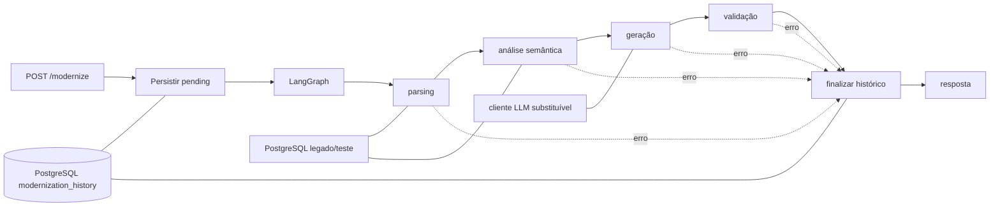
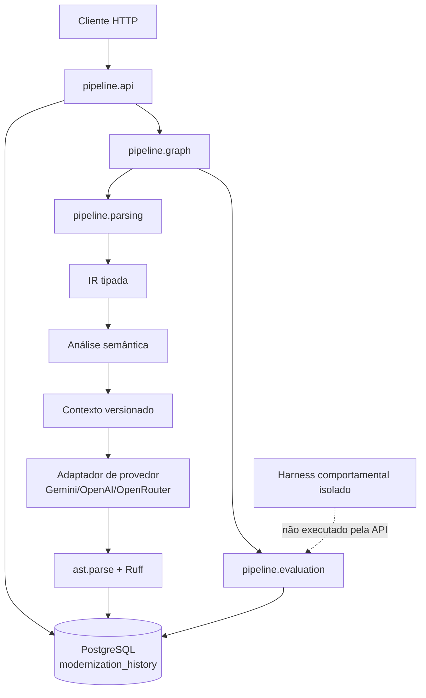

# Arquitetura mínima e contratos

## Escopo

Esta arquitetura descreve o núcleo implementado e seus limites para o desafio. Ela não transforma propostas do contexto em decisões aprovadas automaticamente. O parser produz uma IR estrutural, não uma AST completa de PL/pgSQL; a evidência atual de equivalência comportamental está limitada aos três cenários documentados para B e C.

## Fluxo



## Diagrama de componentes e fronteiras



As setas pontilhadas representam uma fronteira de avaliação, não um caminho
de produção. O comparador só deve receber observações capturadas em ambiente
isolado e nunca inferir equivalência a partir da validação estática.

## Componentes e responsabilidades

| Componente | Responsabilidade | Não é responsável por |
|---|---|---|
| `pipeline.api` | Validar entrada, obter pool, iniciar/finalizar histórico e responder HTTP | Implementar parsing ou executar código gerado |
| `pipeline.graph` | Registrar os quatro nós e as transições do LangGraph | Decidir sozinho a equivalência |
| `pipeline.contracts` | Tipos de entrada, IR, relatórios, erros e resposta | Persistir ou chamar provedores |
| `pipeline.state` | Estado compartilhado do grafo | Ser banco de histórico |
| `pipeline.db` | Criar pool, schema mínimo e atualizar histórico | Controlar semântica da rotina legada |
| nó de parsing | Produzir estrutura de origem e IR; marcar desconhecidos | Inferir correção de negócio |
| nó de análise | Produzir fatos, riscos e decisões rastreáveis | Corrigir o SQL legado |
| nó de geração | Produzir código conforme contexto e contrato | Validar comportamento por execução |
| nó de validação | Executar `ast.parse`, lint e checks de contrato | Declarar equivalência comportamental |

## Contratos tipados

Os tipos estão em `src/pipeline/contracts.py` e o estado em `src/pipeline/state.py`.

### Entrada

```json
{
  "source_code": "SELECT 1;",
  "schema": null,
  "provider": "gemini",
  "model_name": null
}
```

`source_code` é obrigatório e não vazio. `schema` é opcional e não deve ser tratado como instância automática do banco. `provider` aceita `gemini`, `openrouter` ou `openai`; `model_name` e `api_key` são opcionais. A chave pode vir da requisição, mas nunca é persistida no relatório.

### Representação intermediária

A IR deve preservar, quando disponível: nome/tipo da rotina, linguagem, parâmetros e modos, retorno, variáveis, operações, tabelas, chamadas, trechos de origem e construções não suportadas. Fato extraído e inferência devem ser campos ou achados distinguíveis no relatório; a IR não pode ocultar ausência de extração.

### Relatório por etapa

Cada entrada de `stage_reports` contém estágio, status, achados, decisões, avisos, erros e duração somente quando medida. Duração, tokens, custo e versão de modelo não podem ser preenchidos com estimativas.

### Erros e estados

- `pending`: registro criado, mas a pipeline ainda não terminou ou a fatia atual deliberadamente não implementa a etapa.
- `success`: todas as validações exigidas para a etapa passaram; não significa equivalência comportamental.
- `failure`: a execução terminou com erro impeditivo e o relatório foi finalizado.
- `partial`: houve saída utilizável, mas uma etapa ou validação ficou incompleta/limitada.

`ExecutionError` deve informar código, mensagem, estágio, possibilidade de recuperação e detalhes seguros. Segredos e SQL desnecessariamente duplicado não devem entrar em logs.

## Transações e finalização

1. A API cria o registro `pending` antes de iniciar nós.
2. Cada operação de persistência confirma sua própria transação.
3. O grafo não deve depender apenas do caminho de sucesso para finalizar o histórico.
4. Falha controlada deve tentar atualizar `failure` ou `partial`; se o banco cair durante essa atualização, a resposta deve declarar que a persistência não foi confirmada.
5. Interrupção de processo entre criação e finalização permanece uma lacuna conhecida; não há recuperação de crash nesta etapa.

## Tentativas e ciclos

`generation_attempts` conta tentativas de geração. O fluxo pode permitir no máximo uma tentativa de reparo após uma validação objetiva; sem uma política explicitamente implementada, o fluxo deve finalizar em vez de repetir. Não há loop ilimitado implícito no grafo.

## Troca de modelo e dialeto

O cliente LLM deve ser uma fronteira pequena, recebendo contexto estruturado e devolvendo texto/metadata conforme contrato. Um novo modelo não deve mudar o estado do grafo. Um novo dialeto deve fornecer parser/normalizador separado e declarar capacidades; não se cria uma abstração genérica antes de existir um segundo dialeto.

## Exemplos de contrato

### Sucesso estático

```json
{
  "run_id": 10,
  "status": "success",
  "generated_code": "def saldo_cliente(...): ...",
  "report": {"validation": {"ast_parse": "passed", "lint": "passed"}}
}
```

Isso demonstra somente validação estática; não prova equivalência.

### Falha de parsing

```json
{
  "run_id": 11,
  "status": "failure",
  "report": {"errors": [{"code": "PARSE_UNSUPPORTED", "stage": "parsing"}]}
}
```

### Falha de validação

```json
{
  "run_id": 12,
  "status": "failure",
  "report": {
    "validation": {"ast_parse": "failed"},
    "generation_attempts": 1
  }
}
```

Os exemplos são contratos ilustrativos, não resultados de testes executados.

## Estado atual da implementação

- A IR e a análise são produzidas pelos nós reais e têm fixtures A–F preservadas.
- O grafo possui parsing, análise, geração, validação, reparo limitado e finalização; falhas controladas são registradas nos relatórios de etapa.
- A geração seleciona Gemini, OpenRouter ou OpenAI por configuração da requisição/ambiente. A ausência de credencial mantém o modo simulado explicitamente identificado.
- `ast.parse` e Ruff validam a saída, mas não autorizam alegação de equivalência.
- Existe evidência comportamental para B/C em três cenários. D–F têm artefatos e revisão semântica, porém não estão incluídos em uma alegação de equivalência.
- Langfuse e o dashboard Streamlit são integrações opcionais/de operação; o trace real do `run_id=30` e sua captura estão versionados, sem ampliar a alegação para custos, retenção ou alertas.

## Decisões arquiteturais e validações pertinentes

Esta seção consolida decisões confirmadas durante a validação do projeto:

| Decisão | Evidência/validação | Limite e condição de revisão |
|---|---|---|
| Usar Python 3.14 com LangGraph CLI atualizado e versionado | A CLI carregou a aplicação customizada; as versões devem ser verificadas novamente após a atualização | Revisar se a documentação oficial ou a instalação limpa indicar incompatibilidade |
| Manter PostgreSQL isolado em Docker Compose | O container isolado respondeu e persistiu `modernization_history` | Não usar bancos existentes; revisar para ambiente de produção |
| Usar parsing híbrido e IR própria | Os experimentos mostraram que nenhum parser candidato cobre sozinho PL/pgSQL completo | Marcar construções desconhecidas e revisar quando a cobertura B–F for medida |
| Preservar queries, tipos, locking e transações no PostgreSQL quando necessário | Decisão alinhada aos riscos de semântica dos anexos e ao contrato de conexão assíncrona | Revisar somente com evidência comportamental comparável |
| Manter o cliente LLM pequeno e o modelo configurável | Permite registrar modelo/prompt e trocar provedor sem alterar o grafo | Não criar abstrações adicionais antes de uma necessidade comprovada |
| Selecionar o provedor no início de cada execução | `ModernizeRequest`, `PipelineState` e `pipeline.llm.client` carregam `provider`, `model_name` e a chave sem mudar a topologia do grafo; ver [ADR-016](adr/ADR-016-selecao-de-provedor-llm.md) | Revisar se surgir necessidade de streaming, ferramentas ou capacidades diferentes por provedor |
| Permitir no máximo um reparo | Evita ciclos ilimitados e preserva tentativas anteriores | Revisar apenas com métricas de custo e taxa de correção |
| Manter observabilidade e dashboard como camadas opcionais | O adaptador Langfuse não interrompe a execução sem credenciais; o `run_id=30` comprovou a ingestão remota; `dashboard.py` consome API e histórico para operação humana | Revisar quando forem definidos autenticação, retenção, alertas e custos |

### Regra de fidelidade ao legado

Uma tradução não pode corrigir silenciosamente uma regra, validação, ordem, arredondamento, exceção, efeito transacional ou outro comportamento do legado. Todo comportamento aparentemente incorreto deve ser classificado separadamente como **achado do legado**, com trecho de origem e evidência disponível. Uma correção só pode entrar no código gerado quando houver decisão explícita registrada, justificativa e validação própria.

As validações devem distinguir: fato extraído do SQL, inferência da análise, comportamento observado em banco, comportamento ainda não testado e divergência identificada. `ast.parse`, lint e ausência de erro não autorizam alegação de equivalência.
